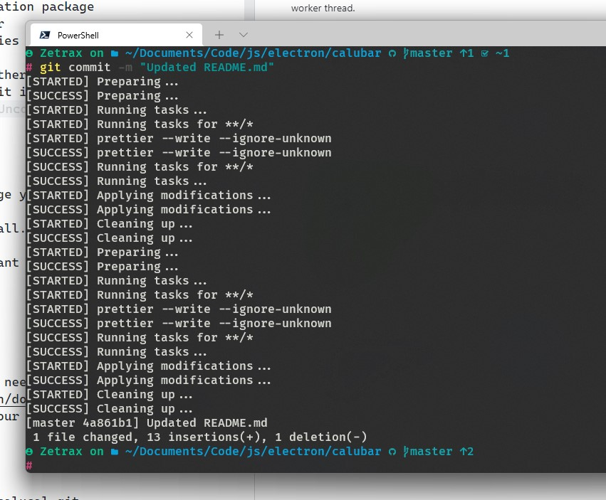

# Calubar

A simple app that is used to manage your applications, automatically.This application features

- ReactJS, with Antd UI framework
- Typescript
- Eslint & Prettier, formating and style-enforcement
- husky, for linting and formatting on commit
- webpack, configuring the build & transpiling of typescript, helps with Obfuscation the scource code.
- jest, unit testing suite (configured but not used)
- electron-forge, for generating application package
- squirrel, for making windows installer
- dependabot, for checking valnurabilities

This application is multi-threaded, if there is a task that is compute intensive like calculating **rebars**, it is computed on a separate worker thread.

.
_husky at work_ 😍

## Introduction

This program lets you organize and manage your applications you download
from the web as a zip archive or a tarball. If you are just putting them
anyplace you have downloaded them and want to organize your apps This will
help you with that.

## To Use

To clone and run this repository you'll need [Git](https://git-scm.com) and [Node.js](https://nodejs.org/en/download/) (which comes with [npm](http://npmjs.com)) installed on your computer. From your command line:

```bash
# Clone this repository
git clone https://github.com/theZetrax/calucal.git
# Go into the repository
cd calubar
# Install dependencies
yarn
# Run the app
yarn package
# If you want to make a Windows installer use
yarn make
```

Note: If you're using Linux Bash for Windows, [see this guide](https://www.howtogeek.com/261575/how-to-run-graphical-linux-desktop-applications-from-windows-10s-bash-shell/) or use `node` from the command prompt.

## Re-compile automatically

To recompile automatically and to allow using [electron-reload](https://github.com/yan-foto/electron-reload), run this in a separate terminal:

```bash
npm run watch
```

## License

[Apache-2.0](LICENSE.md)
